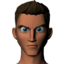
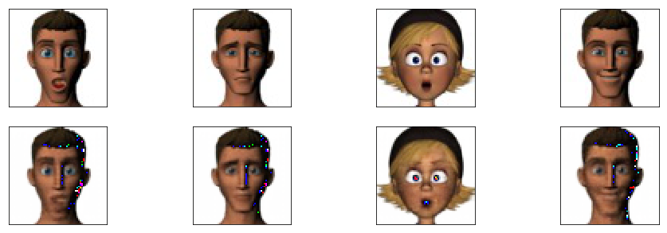
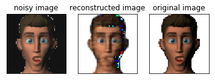
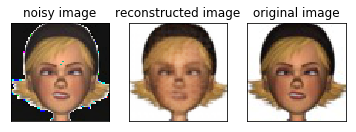

# Convolutional-Auto Encoder using Pytorch
We use the Convolutional AutoEncoder Network model to train animated faces :couple: and test from a random noise added to the original image as input (to check if it performs on noised inputs).

Refrence:[Pytorch](https://pytorch.org/)
	 <br/>
         [REF paper](https://arxiv.org/abs/1701.04949)  

## Requirements

	 1. Pytorch
	 2. torchsummary

## Usage

### Prepare Training Dataset 
Create folder named ``data`` . Then create folders according to your class-label names(n folders for n classes).Then place all images into the corresponding folder(class-label).

###### Folder structure

```
Root
│
├── data
│    └── train
│          ├── Man
│          │    ├── ONE_0.png 
│    	   │	├── ONE_1.png
│    	   │	└── ...
│    	   ├── Woman
│          │    │ 
│    	   │	├── TWO_0.png
│    	   │	└── TWO_1.png
│    	   ├──	.
│    	   └── 	.
│
│ 
│
├── ConvAE.ipynb
├── encoder.pkl
└── decoder.pkl
```
 
> Larger the number and variation in images, larger the accuracy of classification.

### Conv AE Architecture

#### Encoder Network

```javascript
----------------------------------------------------------------
        Layer (type)               Output Shape         Param #
================================================================
            Conv2d-1        [-1, 32L, 66L, 66L]             896
              ReLU-2        [-1, 32L, 66L, 66L]               0
         MaxPool2d-3        [-1, 32L, 33L, 33L]               0
            Conv2d-4        [-1, 64L, 35L, 35L]           18496
              ReLU-5        [-1, 64L, 35L, 35L]               0
         MaxPool2d-6        [-1, 64L, 17L, 17L]               0
================================================================
Total params: 19392
Trainable params: 19392
Non-trainable params: 0
----------------------------------------------------------------
None
```
#### Decoder Network

```javascript
----------------------------------------------------------------
        Layer (type)               Output Shape         Param #
================================================================
   ConvTranspose2d-1       [-1, 128L, 16L, 16L]          131200
              ReLU-2       [-1, 128L, 16L, 16L]               0
   ConvTranspose2d-3        [-1, 64L, 32L, 32L]          131136
              ReLU-4        [-1, 64L, 32L, 32L]               0
   ConvTranspose2d-5         [-1, 3L, 64L, 64L]            3075
================================================================
Total params: 265411
Trainable params: 265411
Non-trainable params: 0
----------------------------------------------------------------
None
```

### Training 

Run the ``ConvAE.ipynb`` jupyter notebook to start the Training.

Once the training is completed the result is stored the main folder as ``encoder.pkl`` and ``decoder.pkl``

###### Input-data



###### Training phase images


###### Final Generated Images on noised input

<br/>


#### ToDo
- [x] Train.
- [x] Save/Load checkpoint.
- [x] check for noisy input.
- [ ] UI for input, output and to download checkpoint.

##### Credits
```javascript
@inproceedings{aneja2016modeling,
  title={Modeling Stylized Character Expressions via Deep Learning},
  author={Aneja, Deepali and Colburn, Alex and Faigin, Gary and Shapiro, Linda and Mones, Barbara},
  booktitle={Asian Conference on Computer Vision},
  pages={136--153},
  year={2016},
  organization={Springer}
}
```


